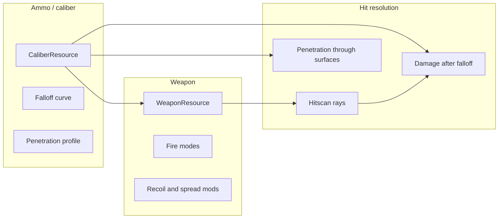

# FPS realism: data-driven combat + range sandbox (Godot 4.6)

## Constraints from your answers

| Choice                                           | Implication                                                                                                                                                                           |
| ------------------------------------------------ | ------------------------------------------------------------------------------------------------------------------------------------------------------------------------------------- |
| **PvE / range first**                            | No multiplayer code path required now; keep gameplay logic in single-player-friendly nodes, avoid hidden singletons that assume one local player if you might add split-screen later. |
| **Data-driven + falloff + penetration, no drop** | Use **hitscan** (or very short segment casts) with range-based damage curves and penetration stacks—not full trajectory simulation yet.                                               |
| **PvP later**                                    | Separate **authoritative-friendly** data (weapon fires → applies damage from stats) from presentation (VFX, audio). Easier to move under a server later.                              |
| **Small arsenal + Vector**                       | Implement **fire modes** (semi / burst / auto) and **per-weapon modifiers** (recoil, spread, ROF, “recoil mitigation” as a stat) on top of shared **caliber** definitions.            |

## Core design: caliber vs weapon

- **Caliber / cartridge** (e.g. `.45 ACP`, `9×19mm`, `12ga buck`, `12ga slug`): base damage, penetration class, **damage falloff curve** (distance → multiplier), and optional pellet count for buckshot.
- **Weapon**: references ammo type, **fire mode table** (Vector: semi + **2-round burst** + full auto if desired), ROF caps, spread, recoil pattern, and **recoil mitigation** (Scalar or curve—Vector higher than a generic SMG).
- **Same ammo, different guns**: Glock 45 vs 1911 both read `**.45 ACP`** for terminal ballistics; differences come from **accuracy, recoil, ergonomics** (spread, recovery), not from inflating base damage per gun.

## Shotguns (buck vs slug)

- **Buckshot**: N pellets (e.g. 8–9), each ray with spread cone; each pellet uses caliber falloff tuned so **effective combat range ~35 yd** in data (curve + max range).
- **Slugs**: single ray, tighter spread, **longer** falloff / higher velocity proxy so **~100 yd** is plausible on steel/paper targets.
- All distances in **meters** internally; show **yards** on range UI for familiarity (`1 yd ≈ 0.9144 m`).

## Kriss Vector (and similar)

- **2-round burst**: state machine or burst counter on trigger pull—fires two shots with enforced spacing, then cooldown or switch to next mode per your preference.
- **Recoil compensation**: implement as **reduced vertical recoil / faster recovery** (and optionally reduced camera kick) **relative to same-caliber SMGs**, driven by `WeaponResource` fields—not a special-case script unless necessary.

## Shooting-range sandbox (first playable)

- **Greybox range**: lanes, distance markers (m + yd), static **steel/paper targets** with hit zones (optional separate multipliers).
- **Ballistics helpers**: penetrable panels (wood/metal tiers) to validate penetration without enemies.
- **Weapon spawner / rack**: cycle or pick from your small arsenal; HUD: ammo, fire mode, current caliber summary (debug overlay helps tuning).

## Suggested project layout (new)

- `[scripts/player/](scripts/player/)` — first-person body, camera, input, weapon holder.
- `[scripts/combat/](scripts/combat/)` — hitscan service, damage application, penetration.
- `[scripts/weapons/](scripts/weapons/)` — firing logic, burst, recoil application.
- `[resources/weapons/](resources/weapons/)` — `.tres` or scripted `Resource` classes for calibers and weapons.
- `[scenes/range/](scenes/range/)` — main range scene + targets.

## Technical notes (Godot 4.6 + Jolt)

- Use **PhysicsRayQuery3D** (or shape casts for pellets) in `_physics_process` for consistent hit order; layer/mask for world vs characters vs penetrable props.
- **Jolt** is already set in `[project.godot](project.godot)`; rigid targets can react to impulse later.

## What we are explicitly deferring

- Bullet drop / wind / ricochet (can add once hitscan tuning feels right).
- PvP / rollback / dedicated server (keep combat pure functions where possible).
- Full animation sets—placeholder meshes and procedural recoil first.

## Open details to decide during implementation (no blocker)

- **Health model**: flat HP vs limb multipliers vs armor plates (affects how penetration reads).
- **Vector burst rule**: burst-only on selector vs burst as one mode among semi/full-auto (common on real selectors).

