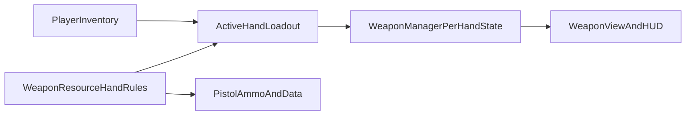

# Pistol Hand Space Plan

## Direction Locked In

- Build a shared foundation that can support `two-hand pistol`, `pistol + utility`, and `akimbo` instead of implementing only one of those features first.
- Reuse the existing equipment slots rather than adding a brand new off-hand slot.
- Treat unused space in the `primary` / `secondary` slot footprints as potential second-hand capacity, but only for weapons that are realistically one-handable.
- Bind `LMB` to hand 1 and `RMB` to hand 2.

## Why This Needs Structural Work

Right now the game is built around exactly one active weapon end-to-end:

- [scripts/player/player_inventory.gd](/home/cottage-end/projects/godot/gun-go-bang-bang/scripts/player/player_inventory.gd) tracks a single `active_slot` and exposes one active weapon.
- [scripts/player/weapon_manager.gd](/home/cottage-end/projects/godot/gun-go-bang-bang/scripts/player/weapon_manager.gd) stores one `current_weapon_data`, one ammo count, one reload state, and one fire pipeline.
- [scripts/player/weapon_view.gd](/home/cottage-end/projects/godot/gun-go-bang-bang/scripts/player/weapon_view.gd) shows one first-person weapon model.
- [scripts/ui/hud.gd](/home/cottage-end/projects/godot/gun-go-bang-bang/scripts/ui/hud.gd) renders one weapon/ammo/fire-mode view.
- [scripts/resources/weapon_resource.gd](/home/cottage-end/projects/godot/gun-go-bang-bang/scripts/resources/weapon_resource.gd) only knows `primary`, `secondary`, and `melee`, with no one-hand or hand-space metadata.

## Proposed Implementation Shape

### 1. Add hand-space metadata to weapon resources

Update [scripts/resources/weapon_resource.gd](/home/cottage-end/projects/godot/gun-go-bang-bang/scripts/resources/weapon_resource.gd) so weapons can declare things like:

- whether they are usable one-handed at all
- how much hand-space they consume inside a slot
- recoil / spread penalties for one-handed use
- extra penalties for off-hand use or akimbo pairing

This keeps the goofy-tech feel from [AGENTS.md](/home/cottage-end/projects/godot/gun-go-bang-bang/AGENTS.md): readable, expressive weapon personality over strict simulation.

### 2. Replace single active weapon with an active hand loadout

Refactor [scripts/player/player_inventory.gd](/home/cottage-end/projects/godot/gun-go-bang-bang/scripts/player/player_inventory.gd) so it can derive a hand loadout from the equipped slots instead of only returning one weapon.

Planned model:

- keep `primary`, `secondary`, `melee`, and `backpack`
- add a computed left/right hand view over the equipped items
- allow a one-hand-capable item to leave room for a second item in the other hand when the combined footprint/rules permit it
- keep larger weapons as forced two-hand occupants
- relax the current `weapon_name` uniqueness and per-name snapshot assumptions if you want true akimbo of identical pistols

The inventory panel at [scripts/ui/inventory_panel.gd](/home/cottage-end/projects/godot/gun-go-bang-bang/scripts/ui/inventory_panel.gd) should then visualize when a slot item still leaves free hand capacity versus when it consumes both hands.

### 3. Split combat state by hand

Refactor [scripts/player/weapon_manager.gd](/home/cottage-end/projects/godot/gun-go-bang-bang/scripts/player/weapon_manager.gd) from one weapon state into per-hand state:

- separate current item/state for hand 1 and hand 2
- separate ammo, reload, fire timers, and caliber selection where needed
- `LMB` fires / uses hand 1 and `RMB` fires / uses hand 2
- one-handed use applies accuracy and recoil penalties
- two-handing the same pistol grants a control bonus
- akimbo keeps independent fire timing instead of collapsing both guns into one fake combined weapon

This is the highest-risk part of the change and should be done before any heavy content pass.

### 4. Update first-person presentation and HUD

Once the logic exists, update:

- [scripts/player/weapon_view.gd](/home/cottage-end/projects/godot/gun-go-bang-bang/scripts/player/weapon_view.gd) to support dual visible hand items or a simple placeholder off-hand representation
- [scripts/ui/hud.gd](/home/cottage-end/projects/godot/gun-go-bang-bang/scripts/ui/hud.gd) to show per-hand ammo/state cleanly
- input/help text so the controls explain `LMB` hand 1, `RMB` hand 2, and any temporary modifiers

For the first implementation pass, the plan should prioritize readable placeholder presentation over a full animation-heavy dual-rig system.

### 5. Layer pistol content and ammo identities on top

After the structure works, use [scripts/data/weapons_pistol_smg.gd](/home/cottage-end/projects/godot/gun-go-bang-bang/scripts/data/weapons_pistol_smg.gd) and [scripts/data/ammo_pistol_smg.gd](/home/cottage-end/projects/godot/gun-go-bang-bang/scripts/data/ammo_pistol_smg.gd) to make pistols meaningfully different without locking balance too early.

Suggested content direction for this pass:

- keep pistol families distinct by handling role more than raw TTK
- let ammo variants express purpose, e.g. body-damage-heavy vs penetration-heavy, without trying to perfect numbers yet
- reserve serious balance passes for playtesting
- document the intended behavior in [learnings/weapon-tuning.md](/home/cottage-end/projects/godot/gun-go-bang-bang/learnings/weapon-tuning.md) once the rules are settled

## Milestone Order

1. Add weapon hand-space metadata and define the rules for one-handable vs forced-two-hand weapons.
2. Refactor inventory state so equipped items can resolve into a left/right hand loadout.
3. Refactor firing, reload, and accuracy handling to operate per hand.
4. Update HUD, inventory visualization, and weapon presentation to match the new model.
5. Adjust pistol/ammo data to take advantage of the new system, without doing a final balance pass yet.

## Main Risks To Watch

- The current per-weapon snapshot system in [scripts/player/weapon_manager.gd](/home/cottage-end/projects/godot/gun-go-bang-bang/scripts/player/weapon_manager.gd) is keyed by weapon name, which will break true duplicate akimbo unless changed to item-instance state.
- The inventory UI currently thinks in whole-slot occupancy, so the new hand-space idea needs a clear visual language or it will feel confusing.
- Dual input can fight ADS / interaction expectations, so `RMB` becoming hand 2 use will likely require revisiting how ADS works for pistols and larger weapons.

## Suggested First Implementation Default

Treat this first build as a gameplay-and-UI foundation pass:

- placeholder dual-hand presentation is acceptable
- real tuning waits until playtesting
- AP / HP / RIP-style ammo identity is included conceptually, but only coarse numbers are needed at first

