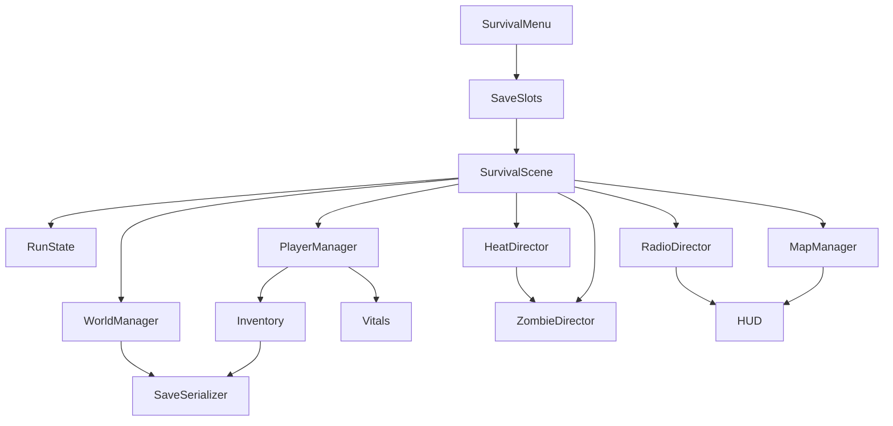

# Survival Implementation Plan

## Current Starting Point

Survival currently enters through `scenes/ui/main_menu_survival.tscn` and loads `scenes/survival/zombie_arena.tscn`. The runtime in `scripts/survival/zombie_arena.gd` builds a flat floor, spawns the player, two weapon pickups, twelve simple zombies, HUD, and pause menu. Saves are only slot markers in `scripts/survival/survival_save_slots.gd`:

```gdscript
file.store_string(JSON.stringify({"v": 1}))
```

The existing FPS, weapon, inventory, HUD, pause, and menu code should be preserved and extended rather than thrown away.

## Architecture Target

Create a Survival runtime made of small managers owned by a single scene coordinator instead of growing `zombie_arena.gd` into a giant script.



Primary new systems should live under `scripts/survival/`, with reusable item/inventory code under `scripts/player/`, `scripts/resources/`, or `scripts/data/` only when it clearly belongs there.

## Phase 1: Survival Run Shell And Versioned Saves

Goal: replace stub-only saves with a real save/load spine while keeping the current arena playable.

- Extend `scripts/survival/survival_save_slots.gd` into a real slot API: `read_slot`, `write_slot`, `delete_slot`, `create_new_game`, `has_save`, `get_slot_summary`.
- Add versioned save dictionaries with explicit sections: `settings`, `world`, `player`, `inventory`, `weapons`, `bases`, `zombies`, `time`, `radio`, `map`.
- Add a `scripts/survival/survival_run_state.gd` or similar coordinator-owned state object for current slot, save settings, elapsed time, seed, permadeath, PvP mode, and dirty/save flags.
- Refactor `scripts/survival/zombie_arena.gd` toward a Survival scene coordinator while keeping the existing boot meta contract from `scripts/ui/main_menu_survival.gd`.
- Preserve menu behavior documented in `learnings/menus-and-flow.md`; returning to menus should not lose the Survival/Game modes flow.
- Add a manual save trigger for now through pause/menu flow, then later autosave on important events.

Verification:

- New game creates a versioned save with world seed/settings.
- Load reads that save and restores at least player spawn position and run metadata.
- Old `{ "v": 1 }` stubs are either upgraded or treated as empty/new-run saves without crashing.

## Phase 2: General Item Model, Inventory Serialization, And Ammo From Inventory

Goal: evolve the current weapon-only inventory into survival inventory without breaking weapon handling.

- Introduce a generic item definition resource, likely `scripts/resources/item_resource.gd`, with id, display name, footprint, stack size, weight, category, tags, and optional weapon/ammo data links.
- Keep `WeaponResource` as the weapon behavior definition. Wrap weapons as inventory items instead of making every inventory item be a weapon.
- Update `scripts/player/player_inventory.gd` so entries can represent weapons, ammo stacks, resources, food, medicine, tools, and deployables.
- Preserve current backpack/category/equipment behavior from `learnings/inventory-interactions.md`: no overlap, atomic swaps, equipped slot sync, rotation, and quick moves.
- Add inventory serialization/deserialization for item id, item type, stack count, container, grid position, rotation, weight, condition, lock/state metadata.
- Update `scripts/player/weapon_manager.gd` reload flow so reloads consume compatible ammo stacks from inventory instead of filling magazines from nowhere.
- Serialize weapon per-item state currently held in `_item_snapshots`: magazine ammo, caliber index, fire mode, reload progress if needed, and condition.
- Add ammo/resource pickups by extending `scripts/pickups/weapon_pickup.gd` into a shared pickup base or adding sibling pickup scripts that use the existing interaction ray layer.

Verification:

- Existing weapon pickups still work.
- Reload fails when no matching ammo exists.
- Reload consumes ammo from inventory stacks.
- Save/load preserves backpack layout, equipped weapons, magazine state, reserve ammo, selected caliber, and fire mode.

## Phase 3: Player Vitals, Damage, Death, Beds, And Corpse Recovery

Goal: make Survival survivable and losable before building the full world.

- Add a `scripts/player/player_vitals.gd` node or component for health, stamina, hunger, thirst, temperature, infection, fatigue, and simple injury debuffs.
- Add `take_damage` and death handling to `scripts/player/player_controller.gd` or a child combat/vitals node so zombies and later PvP can use one damage path.
- Expand `scripts/ui/hud.gd` to subscribe to vitals signals and show Rust-like health/stamina/status readouts, hitmarkers, and status-effect indicators.
- Add basic zombie melee to `scripts/survival/zombie.gd` using cooldowns and player `take_damage`.
- Add bed/respawn objects: bedroll, cot, proper bed, vehicle bed. Start with bedroll and cot.
- Implement death flow through a survival respawn manager: corpse/backpack spawn, valid bed list, bed cooldowns, death-zone bed exclusion, fallback starter respawn for non-permadeath saves.
- Implement infection meter and infection-death player zombie. First version can spawn a special zombie with a recoverable inventory container.
- Save/load beds, cooldowns, corpse containers, and player-zombie containers.

Verification:

- Zombies can down/kill the player.
- Player respawns at a valid bed when allowed.
- Nearby beds are blocked after death.
- Corpse recovery returns inventory.
- Infection death creates a hostile recoverable player-zombie.

## Phase 4: Procedural Island Prototype And Rust-Like Map Reveal

Goal: move from the flat arena to a persistent explorable world while keeping scope practical.

- Replace the single `FLOOR_SIZE` arena in `scripts/survival/zombie_arena.gd` with a `scripts/survival/world/survival_world_manager.gd` that owns chunk generation.
- Start with simple generated terrain tiles or chunk scenes before advanced terrain: coast/spawn fringe, woods, suburbs, towns, roads, and hotspots.
- Add deterministic generation from world seed, with generated chunk metadata saved or reproducible.
- Add POI placement and loot spawn tables for early suburbs, woods, towns, and hotspots.
- Add discovered map cells to save data.
- Add a `scripts/survival/map_manager.gd` for Rust-like explored map reveal and nearby minimap data.
- Add HUD/map UI that shows explored terrain, roads, buildings, POIs, player markers, beds, bases, death locations, radio events, and supply drops.
- Do not show live zombie positions by default.

Verification:

- Same seed produces the same island layout.
- Map reveal persists across save/load.
- Minimap works for nearby orientation.
- Loot and POIs appear from deterministic tables and can be saved when looted.

## Phase 5: Loot, Crafting, Research, And Tech Tracks

Goal: give scavenging and bases a progression backbone.

- Add data-driven loot tables under `scripts/data/` for suburbs, woods, towns, hotspots, zombies, and radio contracts.
- Add basic non-weapon items: food, water, bandages, scrap, wood, cloth, ammo components, fuel/batteries, tools, simple meds.
- Add field crafting for essentials.
- Add workstation/deployable objects for research bench, workbench, cooking, gunsmith, vehicle, medical/chemistry, electronics/power, farming/cooking, clothing/tailoring.
- Add recipe definitions with required items, station, skill/recipe gates, craft time, and output.
- Add research bench flow: study time, resource cost, item breakdown, repeat sample counts for advanced recipes.
- Add use-based skill progression and found books/manual recipe unlocks.
- Persist unlocked recipes, skill progress, station states, and in-progress crafts.

Verification:

- Player can loot resources, craft basic items, place a workstation, research found items, and unlock/craft a gated item.
- Save/load preserves unlocked recipes, station inventory, and skill progress.

## Phase 6: Bases, Tool Cupboards, Locks, Upkeep, And Building

Goal: make the base loop real before making hordes complex.

- Add build/deployable definitions for foundations/walls/doors/locks, storage, barricades, lights, generators, water collectors, traps, and basic workstations.
- Implement grid/snap building and fortifying existing structures where possible.
- Add tool cupboard objects with authorization lists, claim radius, build permission checks, upkeep inventory, and base identity.
- Add lock objects for doors, inventories, storage, and vehicles; authorized users can open, unauthorized users must break in if the save rules allow it.
- Add base part condition/damage states and repair from stocked upkeep.
- Add decay when upkeep is empty, plus environmental damage hooks for weather later.
- Persist build pieces, ownership, locks, TC auth, upkeep inventory, damage, decay, and repair state.

Verification:

- Player can place a TC, build within claim, authorize access, lock storage, stock upkeep, save/load the base, and see damage/repair/decay state persist.

## Phase 7: Heat System, Zombie Director, Hordes, And Base Attacks

Goal: connect base activity to zombie pressure.

- Add `scripts/survival/heat/heat_source.gd` components or data records for lights, generators, vehicles, gunfire, crafting, radios, kills, stockpiles, and player traffic.
- Add `scripts/survival/heat/heat_director.gd` that aggregates heat by area/base over time and exposes query APIs to zombies, radio, map overlays, and save data.
- Replace fixed zombie ring spawning with a `scripts/survival/zombie_director.gd` that can spawn roamers, POI zombies, night pressure, and event hordes.
- Upgrade `scripts/survival/zombie.gd` target selection: player, noise/light object, generator, door/window/weak point, base structure.
- Add pathfinding via `NavigationAgent3D` or a chunk-level navigation solution before base attacks get complex.
- Add base attack behaviors: prefer weak points, damage blocks if blocked, target lights/generators/radios, and support climber/stack/crawl variants later.
- Implement special zombies in stages: runner first, screamer second, sparkhead/light-seeker third, biome variants later.
- Add NWS-style radio horde/weather alerts based on heat and world events.

Verification:

- Turning on lights/generator increases heat.
- Zombies investigate heat sources and can damage simple base parts.
- Night increases pressure.
- Radio warns before serious horde/weather events.
- Save/load preserves active world heat and pending events.

## Phase 8: Weather, Time, Temperature, Animals, Vehicles, And Radio Contracts

Goal: finish the main spec pillars after the core loop is playable.

- Add time-of-day and night rules. Night should increase zombie activity and make bright bases riskier.
- Add weather states: clear, rain, storm, fog, cold front. Weather affects visibility/audio, temperature, zombie behavior, and rain collectors.
- Add temperature integration with shelter, clothing, wetness, fires, heating, and fatigue.
- Add animals as food/material sources and occasional threats/noise-makers.
- Add vehicles for travel, hauling, fuel, noise, damage, storage, locks, and later vehicle beds.
- Add radio contracts for supply drops and world events such as crashed convoys, odd signals, blackouts, migrations, or trader rumors.
- Persist weather, time, event state, vehicle state, animal/resource state, and active radio contracts.

Verification:

- Weather changes survival and zombie behavior.
- Rain fills collectors faster.
- Vehicles help hauling but generate heat/noise.
- Radio contracts create map events and rewards.

## Phase 9: LAN-Ready Boundaries And Future Server Prep

Goal: keep the singleplayer implementation from hard-coding assumptions that block LAN or servers.

- Treat host authority as the owner of save state, world generation, zombies, heat, beds, bases, and loot.
- Keep player identity separate from local input so LAN joiners can own beds, locks, TC auth, corpses, and inventory.
- Store permissions by stable player id, not scene node path.
- Ensure pause behavior can avoid freezing the whole tree in LAN sessions; `scripts/ui/pause_menu.gd` already has solo-session expectations to build on.
- Make save settings explicit: permadeath, PvE/PvPvE/PvP, zombie strength, survival strictness, loot abundance, world seed/size/biomes.
- Lock permadeath and world seed at creation; allow PvP mode and some difficulty rates to be changed later if desired.
- Defer dedicated-server offline protection until real server work begins.

Verification:

- Local singleplayer still works.
- Save data can represent multiple player identities.
- Auth/locks/TCs do not assume only one player forever.

## Suggested Milestone Order

1. **Playable Save Loop:** real save/load, player inventory serialization, basic loaded survival run.
2. **Death Loop:** vitals, zombie damage, beds, corpse recovery, fallback respawn.
3. **Survival Inventory:** generic items, ammo from inventory, weight, resources, pickups.
4. **Small Generated World:** deterministic chunks, POIs, loot, explored map/minimap.
5. **Base Prototype:** TC, simple building, locks, upkeep, damage.
6. **Heat And Night Horde:** lights/noise heat, zombie director, radio warning, base attack.
7. **Progression Layer:** crafting, research, workstations, tech tracks.
8. **Living World Layer:** weather, animals, vehicles, contracts, deeper events.
9. **LAN Hardening:** player identities, permissions, host authority, scaling.

## Testing Strategy

- Add small GDScript unit-style tests or debug scenes for serialization, inventory placement, ammo consumption, recipe unlocks, and map reveal math where practical.
- Use focused manual test scenes for death/respawn, base damage/upkeep, horde heat, and world chunk generation.
- Every milestone should include save/load verification before moving on.
- Keep the existing shooting range and weapon behavior stable while Survival expands shared systems.

## Key Risks

- Generalizing `PlayerInventory` is high-risk because it currently assumes every item is a weapon.
- Inventory-fed ammo touches reload, ammo wheel, caliber choice, save data, and HUD.
- Procedural world plus map reveal is a separate platform layer and should not be built at the same time as bases/hordes.
- Base building, heat, zombie AI, and navigation are tightly coupled; implement simple versions before adding special zombies or complex raids.
- LAN support is easiest if player ids, ownership, and authority are designed early, even before networking is implemented.